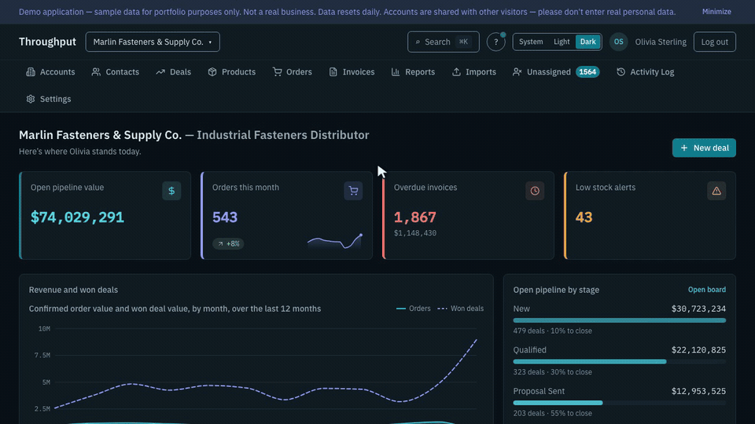

# Throughput

CRM operațional multi-tenant pentru distribuitori B2B: conturi și contacte, pipeline de vânzări, comenzi, stoc, facturare. E un demo de portofoliu cu date realiste și scriere reală — orice vizitator poate lucra în aplicație, iar datele se resetează zilnic.

**Demo live:** [throughput.dbg.ro](https://throughput.dbg.ro) — intră cu un buton, fără cont și fără parolă.



*Opt secunde din demo-ul de 90 de secunde. Înregistrarea completă e mută, cu subtitrări arse în engleză: se filmează automat, cu o coregrafie Playwright pe o bază semănată la volum complet, nu cu mâna.*

**Stare:** funcționalitatea e completă, acoperită de teste și verificată prin două audituri interne cod↔documentație (2026-09-23 și 2026-10-06), inclusiv interfața bilingvă EN + FR ([ADR-022](docs/adr/ADR-022-locale-en-fr-per-utilizator-nu-in-url.md)). Demo-ul rulează live pe Coolify, cu reset zilnic. Rămâne tag-ul `v1.0` și trecerea repo-ului în public.

## Ce demonstrează

- **Multi-tenancy pe cale** (`/{workspace}/…`), cu izolare în două straturi: global scope Eloquent și Row-Level Security în PostgreSQL. O scurgere între tenanți cere ca ambele să greșească simultan ([ADR-002](docs/adr/ADR-002-tenancy-pe-cale.md), [ADR-003](docs/adr/ADR-003-izolare-tenant-doua-straturi.md), [ADR-014](docs/adr/ADR-014-context-de-tenant-o-singura-poarta.md)).
- **RBAC pe patru roluri**, vizibil în interfață: fiecare pagină primește `can` calculat server-side, iar un buton fără drept lipsește, nu e dezactivat.
- **Volum real**: 3 tenanți, 8.000 de conturi, 50.000 de comenzi, 390 de produse, cu liste paginate pe cursor.
- **Scriere concurentă tratată explicit**: numere de comandă și de factură fără goluri, stoc rezervat sub blocare sortată, operații în masă idempotente per chunk, webhook-uri deduplicate pe `event_id`.
- **Interacțiune accesibilă** (WCAG 2.2 AA): kanban cu drag & drop și alternativă completă de tastatură, căutare globală Cmd+K, temă închisă/deschisă randată fără licărire, manual contextual pe fiecare ecran.

## Module

| Modul | Ce acoperă |
|---|---|
| **CRM** | Conturi, contacte, deals cu pipeline configurabil și kanban, vizualizări salvate, coloane reordonabile |
| **Catalog & stoc** | Produse și variante, registru de stoc append-only ([ADR-004](docs/adr/ADR-004-stoc-registru-append-only.md)), recepție / ajustare / transfer, alertă de stoc minim |
| **Comenzi** | Draft → confirmare → onorare parțială → expediere, cu rezervare de stoc și două curierate selectabile per tenant ([ADR-010](docs/adr/ADR-010-doi-furnizori-curierat-configurabili.md)) |
| **Facturare** | Facturi din comenzi, plăți parțiale, anulare cu motiv, PDF generat în coadă ([ADR-019](docs/adr/ADR-019-export-pdf-liste-dompdf-nu-chromium.md)); separat de abonamentul Stripe ([ADR-005](docs/adr/ADR-005-facturare-separata-de-stripe.md)) |
| **Import CSV** | Mapare de coloane cu sugestii, probă uscată, commit parțial cu savepoint per rând, raport de erori reimportabil |
| **Rapoarte** | Definiții cu sursă din vizualizări salvate sau rapoarte built-in, programare orară, livrare pe email ([ADR-009](docs/adr/ADR-009-resend-email-tranzactional.md)) |
| **Operații în masă** | Reatribuire de owner, schimbare de preț, anulare de draft-uri — în coadă, pe chunk-uri, anulabile din mers |
| **Export & GDPR** | Export de listă (CSV / PDF / zip), export complet de workspace pentru portabilitate, anonimizare de contacte |
| **Administrare** | Membri și invitații ([ADR-011](docs/adr/ADR-011-dezactivare-membru-fara-blocare.md)), jetoane API, abonament, jurnal de activitate ([ADR-007](docs/adr/ADR-007-audit-log-cod-propriu.md)), jurnal de email, sănătatea webhook-urilor |
| **API public** | REST versionat pe cale ([ADR-008](docs/adr/ADR-008-versionare-api-pe-cale.md)), scopuri per jeton, `Idempotency-Key` obligatoriu la scriere, contract OpenAPI 3.1 |
| **Internaționalizare** | Interfață completă EN/FR per utilizator (`users.locale`, ales din Settings → Preferences), fără locale în URL ([ADR-022](docs/adr/ADR-022-locale-en-fr-per-utilizator-nu-in-url.md)); gate CI (`i18n:coverage`) verifică simetria celor două cataloage |

## Stack

Laravel 13 (PHP 8.3) · Inertia 3 · React 19 + TypeScript · Tailwind 4 · PostgreSQL 16 · Redis 7 + Horizon. Motivele fiecărei alegeri sunt în [`docs/adr/`](docs/adr/README.md).

## Pornire locală

```sh
cp .env.example .env
php artisan key:generate
docker compose up -d
docker compose exec app php artisan migrate --database=pgsql_migrations
docker compose exec app php artisan demo:seed-volume
```

Aplicația răspunde pe `http://localhost:8000`, iar Vite pe `5173`. De ce migrațiile rulează pe o conexiune separată și de ce comenzile `artisan` rulează în container: [CONTRIBUTING.md](CONTRIBUTING.md).

## Conturi demo

Cu `DEMO_MODE=true` (implicit în `.env.example`), pagina de login are câte un buton „Log in as …" pentru fiecare rol. Nu se tastează nicio parolă.

| Rol | Email | Ce vede |
|---|---|---|
| Owner | `demo.owner@throughput.dev` | Tot, inclusiv billing; comută între cele trei workspace-uri |
| Manager | `demo.manager@throughput.dev` | Acces operațional complet, fără billing și fără setări de curierat |
| Agent | `demo.agent@throughput.dev` | Implicit doar conturile și deals-urile proprii, cu comutare la tot workspace-ul |
| Viewer | `demo.viewer@throughput.dev` | Doar citire, fără butoane de acțiune; exportul rămâne permis |

Workspace-ul vitrină e `marlin`; celelalte două, `cascade` și `northgate`, există ca să se vadă comutatorul și izolarea.

În demo, acțiunile care ar strica sesiunea următorului vizitator sunt ascunse (dezactivarea unui membru, schimbarea de rol), iar emailurile sunt interceptate și vizibile în Settings → Sent Emails. Stripe rulează exclusiv în test mode.

## Date demo

| Comandă | Ce face |
|---|---|
| `php artisan demo:seed-volume` | Setul complet (~60 s) |
| `php artisan demo:seed-volume --scale=0.01` | Același set, cu aceleași reguli de realism, la ~1% din volum — pentru E2E și iterație rapidă |
| `php artisan demo:reset` | `migrate:fresh` + setul complet. În producție rulează zilnic, la 03:00 UTC, ca job pe Horizon ([ADR-017](docs/adr/ADR-017-reset-demo-ca-job-pe-horizon.md)) |
| `php artisan db:explain-critical` | `EXPLAIN ANALYZE` pe interogările critice. Pică dacă una face Seq Scan pe o tabelă mare; căutarea globală are în schimb un buget de timp ([ADR-018](docs/adr/ADR-018-cautare-sub-rls-fara-index-trigram.md)) |

## Teste

- **Pest**, pe PostgreSQL real, rulat cu rolul aplicației (fără `BYPASSRLS`): `APP_ENV=testing ./vendor/bin/pest`. Niciodată SQLite — acolo RLS nu există, deci testele de izolare ar trece fără să testeze nimic. Baza de test e descrisă în [CONTRIBUTING.md](CONTRIBUTING.md).
- Rulează `npm run build` înainte de Pest: layout-ul aplicației cere manifestul Vite.
- **Playwright**, pe aplicația reală cu worker de coadă pornit: `npx playwright test -c e2e/playwright.config.ts`. Pe PR rulează subsetul `@smoke`; suita completă rulează pe `main` și pe tag-uri.
- **k6**: `tests/Performance/reads.js`, rulat local, nu în CI.

## CI

GitHub Actions, cu reguli stricte de consum de minute: build-ul Vite o singură dată, transmis ca artefact, joburile scumpe în spatele celor ieftine, doar `ubuntu-latest`. Motivele sunt scrise în [`.github/workflows/ci.yml`](.github/workflows/ci.yml).

## Documentație

- [`docs/adr/`](docs/adr/README.md) — deciziile arhitecturale; sursă unică, un ADR acceptat nu se rescrie.
- [CONTRIBUTING.md](CONTRIBUTING.md) — cum se lucrează pe proiect.
- [`.ai/rules/`](.ai/rules/index.md) — regulile pentru agenții de cod: capcanele deja plătite, pe zone de cod.
